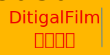
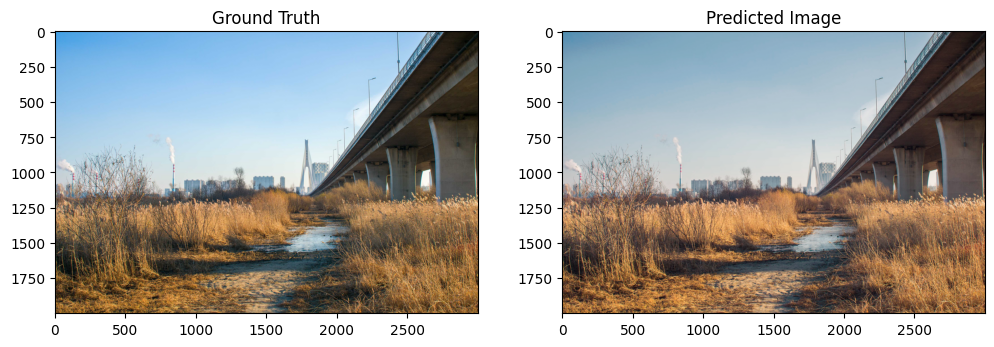
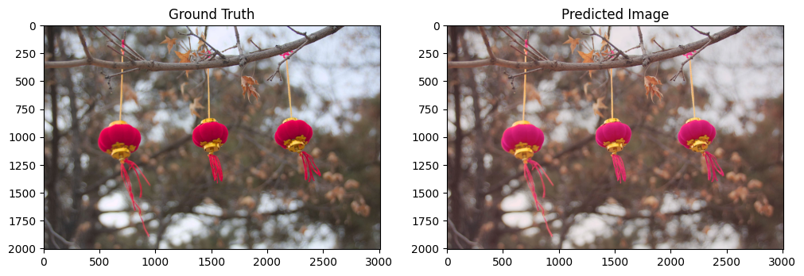
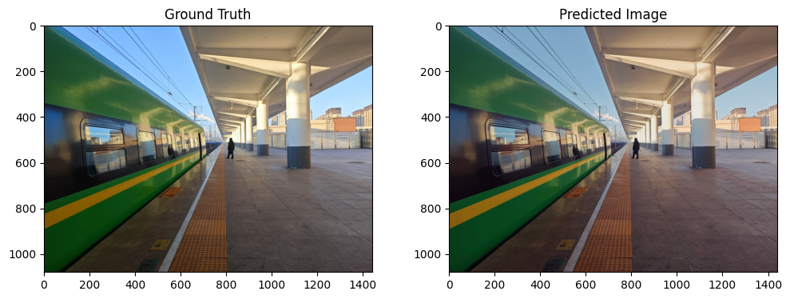
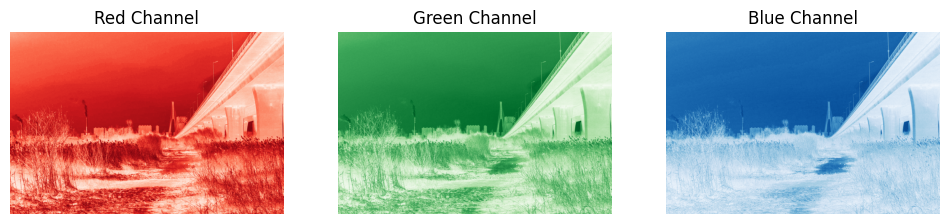
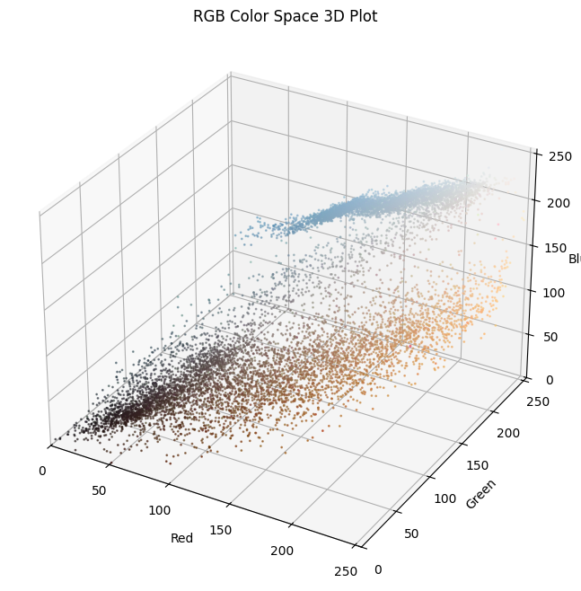

# DigitalFilm - Kodak Gold 200

DigitalFilm： Use a neural network to simulate film style.

---

<!-- PROJECT LOGO -->
<br />

<p align="center">
  <a href="./readme.md">
    
  </a>

  <h3 align="center">"DigitalFilm</h3>
  <p align="center">
    Use a neural network to simulate film style.
    <br />
    <a href="https://github.com/shaojintian/Best_README_template"><strong>Explore the documentation for this project »</strong></a>
    <br />
    <br />
    <a href="./app/digitalFilm.py">View Demo</a>
    ·
    <a href="https://github.com/SongZihui-sudo/digitalFilm/issues">Report bugs</a>
    ·
    <a href="https://github.com/SongZihui-sudo/digitalFilm/issues">Propose new features</a>
  </p>

</p>

This README.md is aimed at developers and users  
[简体中文](./readme.md)

catalogue

-Digital Film - Kodak Gold 200
-[Catalog] (# Catalog)
-[Run Demo] (# Run Demo)
-[* * Installation Steps * *] (# Installation Steps)
-[Overall Architecture] (# Overall Architecture)
-[Dataset] (# Dataset)
-[Comparison of Generated Images] (# Comparison of Generated Images)
-[Color Space for Generating Images] (# Color Space for Generating Images)
-[File Directory Description] (# File Directory Description)
-[Version Control] (# Version Control)
-[Author] (# Author)
-[Copyright Notice] (# Copyright Notice)

### Run Demo

```bash
python digitalFilm.py [-v/-h/-g] -i <input> -o <ouput> -m <model>
```
-- v Print version information
-- h Help Information
-- g Graphically select images
-- i Input the directory of the image
-- o Directory for outputting images
-- m model directory

###### **Installation steps**

```sh
git clone  https://github.com/SongZihui-sudo/digitalFilm.git
```

It's best to create an environment in conda now and install various dependencies.

```sh
pip install -r requirement.txt
```

### Overall architecture

The overall architecture first trains the data generator through manually annotated digital analog film image pairs, and then generates digital labels using the generator. Finally, the model was trained using digital simulated film images, and then fine tuned using the generated digital real film photo dataset.

```txt
----------------------------------------------------------------
        Layer (type)               Output Shape         Param #
================================================================
            Conv2d-1         [-1, 32, 200, 320]             896
       BatchNorm2d-2         [-1, 32, 200, 320]              64
         LeakyReLU-3         [-1, 32, 200, 320]               0
            Conv2d-4         [-1, 64, 200, 320]          18,496
       BatchNorm2d-5         [-1, 64, 200, 320]             128
         LeakyReLU-6         [-1, 64, 200, 320]               0
 AdaptiveAvgPool2d-7             [-1, 64, 1, 1]               0
            Conv2d-8              [-1, 4, 1, 1]             256
              ReLU-9              [-1, 4, 1, 1]               0
           Conv2d-10             [-1, 64, 1, 1]             256
AdaptiveMaxPool2d-11             [-1, 64, 1, 1]               0
           Conv2d-12              [-1, 4, 1, 1]             256
             ReLU-13              [-1, 4, 1, 1]               0
           Conv2d-14             [-1, 64, 1, 1]             256
          Sigmoid-15             [-1, 64, 1, 1]               0
 ChannelAttention-16             [-1, 64, 1, 1]               0
           Conv2d-17            [-1, 128, 1, 1]          73,856
      BatchNorm2d-18            [-1, 128, 1, 1]             256
        LeakyReLU-19            [-1, 128, 1, 1]               0
AdaptiveAvgPool2d-20            [-1, 128, 1, 1]               0
           Conv2d-21              [-1, 8, 1, 1]           1,024
             ReLU-22              [-1, 8, 1, 1]               0
           Conv2d-23            [-1, 128, 1, 1]           1,024
AdaptiveMaxPool2d-24            [-1, 128, 1, 1]               0
           Conv2d-25              [-1, 8, 1, 1]           1,024
             ReLU-26              [-1, 8, 1, 1]               0
           Conv2d-27            [-1, 128, 1, 1]           1,024
          Sigmoid-28            [-1, 128, 1, 1]               0
 ChannelAttention-29            [-1, 128, 1, 1]               0
           Conv2d-30            [-1, 256, 1, 1]         295,168
      BatchNorm2d-31            [-1, 256, 1, 1]             512
        LeakyReLU-32            [-1, 256, 1, 1]               0
AdaptiveAvgPool2d-33            [-1, 256, 1, 1]               0
           Conv2d-34             [-1, 16, 1, 1]           4,096
             ReLU-35             [-1, 16, 1, 1]               0
           Conv2d-36            [-1, 256, 1, 1]           4,096
AdaptiveMaxPool2d-37            [-1, 256, 1, 1]               0
           Conv2d-38             [-1, 16, 1, 1]           4,096
             ReLU-39             [-1, 16, 1, 1]               0
           Conv2d-40            [-1, 256, 1, 1]           4,096
          Sigmoid-41            [-1, 256, 1, 1]               0
 ChannelAttention-42            [-1, 256, 1, 1]               0
           Conv2d-43            [-1, 128, 1, 1]         295,040
      BatchNorm2d-44            [-1, 128, 1, 1]             256
        LeakyReLU-45            [-1, 128, 1, 1]               0
AdaptiveAvgPool2d-46            [-1, 128, 1, 1]               0
           Conv2d-47              [-1, 8, 1, 1]           1,024
             ReLU-48              [-1, 8, 1, 1]               0
           Conv2d-49            [-1, 128, 1, 1]           1,024
AdaptiveMaxPool2d-50            [-1, 128, 1, 1]               0
           Conv2d-51              [-1, 8, 1, 1]           1,024
             ReLU-52              [-1, 8, 1, 1]               0
           Conv2d-53            [-1, 128, 1, 1]           1,024
          Sigmoid-54            [-1, 128, 1, 1]               0
 ChannelAttention-55            [-1, 128, 1, 1]               0
           Conv2d-56             [-1, 64, 1, 1]          73,792
      BatchNorm2d-57             [-1, 64, 1, 1]             128
        LeakyReLU-58             [-1, 64, 1, 1]               0
AdaptiveAvgPool2d-59             [-1, 64, 1, 1]               0
           Conv2d-60              [-1, 4, 1, 1]             256
             ReLU-61              [-1, 4, 1, 1]               0
           Conv2d-62             [-1, 64, 1, 1]             256
AdaptiveMaxPool2d-63             [-1, 64, 1, 1]               0
           Conv2d-64              [-1, 4, 1, 1]             256
             ReLU-65              [-1, 4, 1, 1]               0
           Conv2d-66             [-1, 64, 1, 1]             256
          Sigmoid-67             [-1, 64, 1, 1]               0
 ChannelAttention-68             [-1, 64, 1, 1]               0
           Conv2d-69             [-1, 32, 1, 1]          18,464
      BatchNorm2d-70             [-1, 32, 1, 1]              64
        LeakyReLU-71             [-1, 32, 1, 1]               0
AdaptiveAvgPool2d-72             [-1, 32, 1, 1]               0
           Conv2d-73              [-1, 2, 1, 1]              64
             ReLU-74              [-1, 2, 1, 1]               0
           Conv2d-75             [-1, 32, 1, 1]              64
AdaptiveMaxPool2d-76             [-1, 32, 1, 1]               0
           Conv2d-77              [-1, 2, 1, 1]              64
             ReLU-78              [-1, 2, 1, 1]               0
           Conv2d-79             [-1, 32, 1, 1]              64
          Sigmoid-80             [-1, 32, 1, 1]               0
 ChannelAttention-81             [-1, 32, 1, 1]               0
           Conv2d-82              [-1, 3, 1, 1]             867
           Conv2d-83          [-1, 3, 200, 320]              99
           Conv2d-84              [-1, 3, 1, 1]             195
================================================================
Total params: 805,161
Trainable params: 805,161
Non-trainable params: 0
----------------------------------------------------------------
Input size (MB): 0.73
Forward/backward pass size (MB): 142.14
Params size (MB): 3.07
Estimated Total Size (MB): 145.94
----------------------------------------------------------------
```

### Dataset

At the stage of creating the dataset. Firstly, based on data augmentation technology, simulation film effect images are generated using digital filters applied by Fimo. A preliminary training set is constructed for model pre training, and a digital photo label generation model is synchronously developed. In the second stage, the performance of the model is optimized for real-world scenarios. A dataset is constructed by collecting publicly available Kodajin 200 film samples from the network, and the pre trained label generation model is used to automatically create corresponding digital labels. Ultimately, a two-stage training framework was adopted: first, the model was initialized based on simulation data, and then fine tuned and optimized using a real sample dataset. This progressive training method effectively improved the model's ability to capture real image features while mitigating the risk of overfitting caused by insufficient raw data.

The dataset consists of dual source image data, with the main body collected from high-quality digital photos taken by Xiaomi 13 Ultra smartphones, and the rest selected from professional HDR image datasets [1]. The data annotation system consists of two parallel dimensions: (1) manual annotation group: 1517 pairs of accurately registered digital analog film image pairs, where the film effect is achieved through Fimo professional filters; (2) Automatic generation group: 363 Kodak Gold 200 professional film samples and their corresponding digital labels are automatically generated through a pre trained model. In the data preprocessing stage, a dynamic data augmentation strategy is adopted to apply real-time random spatial transformations to the input image, effectively improving the geometric invariance of the model. The dataset is divided according to the principle of stratified sampling, with 80% (1517 × 0.8+363 × 0.8=1504 images) as the training set and 20% (376 images) as the testing set, ensuring the consistency of the distribution of digital/film samples in the training and testing set.

### Comparison of generated images



<center style="font size: 14px; color: # C0C0C0; text decoration: underline">Figure 1 comparison</center>


 
<center style="font size: 14px; color: # C0C0C0; text decoration: underline">Figure 2 comparison</center>


<center style="font size: 14px; color: # C0C0C0; text decoration: underline">Figure 3 comparison</center>


###Generate color space for images


<center style="font size: 14px; color: # C0C0C0; text decoration: underline">Figure 4 The RGB channel in Figure 1</center>



<center style="font size: 14px; color: # C0C0C0; text decoration: underline">Figure 4 The color space in Figure 1</center>

### File directory description

-DigitalFilm.ipynb is used to train models
-An app demo
- digitalFilm.py 
- mynet.py
- kodark_gold_200.pt

### Version control

This project uses Git for version management. You can refer to the currently available versions in the repository.

### Author

151122876@qq.com  SongZihui-sudo

Zhihu: Dr.who  &ensp;  qq:1751122876    

*You can also see all the developers involved in the project in the list of contributors*

### Copyright Notice

This project has signed a GPLv3 license, please refer to [LICENSE. txt] (./LICENSE. txt) for details