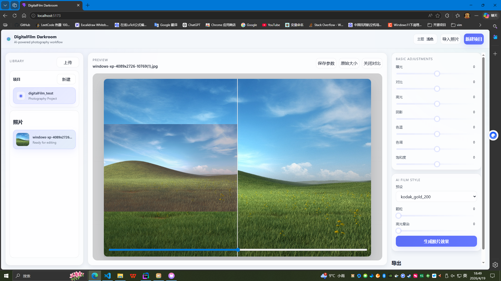

# DigitalFilm

> A digital darkroom system that simulates film aesthetics using neural networks.



DigitalFilm is a project dedicated to film-style simulation, comprising the following components:

- **Model Training Pipeline** - Neural network-based film style transfer
- **MCP Service** - Model Context Protocol integration for AI applications
- **Modern Vue 3 Web Application** - Professional photo editing interface
- **Multi-service Backend Architecture** - Main backend, static assets backend, image processing service

The project's objective is to render digital images with a film-like aesthetic using neural networks, while providing a professional and usable editing workflow.

---

## Quick Start

Run the demo  
```bash
python demo.py
```

Test mcp
```bash
npx @modelcontextprotocol/inspector --transport stdio -- python mcp_server.py
```

## Feature Overview

- Uses neural networks to learn the mapping from digital images to film-style images.
- Supports previewing and saving basic image editing parameters.
- Supports project and image management.
- Supports image uploading, static hosting, and access to generated result images.
- Supports integration with other AI applications via the MCP service.
- Supports image generation and processing via a dedicated, standalone image service.

---

## Project Structure

A typical project structure is as follows:

```text
DigitalFilm/
├── app/                    # DigitalFilm application frontend / desktop client code
├──────── master_backend/         # Main backend: manages data for projects, images, parameters, etc.
├──────── static_backend/         # Static assets backend: hosts uploaded images and generated results
├──────── image_server.py         # Python image processing service
├── pipeline.py             # Training entry point
├── mcp_server.py           # MCP service entry point
├── options/                # Model and training configurations
├── example/                # Example images
└── ...
```

## Environmental Dependencies
To use this project, you must install:

Python
Go
If the frontend component within the `app/` directory utilizes Vue, you will also need:

Node.js
pnpm / npm / yarn

## Model Training
The entry point for training is:

```BASH
python pipeline.py
```
You can adjust training parameters by modifying the configuration files; examples include:

Dataset path
Batch size
Learning rate
LUT dimensions
Whether to enable 3D / 4D LUTs
Number of basis functions
Options such as `residual`, `blend`, etc.

## MCP Service
The project provides an MCP service, allowing other AI applications to integrate with and utilize its capabilities. Startup Method:

```BASH
python mcp_server.py
```
Once started, you can integrate this MCP service into any MCP-compatible AI application or agent system to leverage DigitalFilm's capabilities.

## Application Startup
The `app/` directory contains the DigitalFilm application, which supports the following features:

Basic image editing
Image uploading and project management
Film-style conversion
Image parameter saving and restoration
Pre-startup Requirements
To use the DigitalFilm App, you must first launch the following services:

Python Image Editing Server
Go Main Backend
Go
1. Launch the Image Processing Service
The image processing service is responsible for executing tasks related to image generation, image editing, and model inference.

```BASH
python image_server.py
```

2. Launch the Main Backend
The main backend is responsible for:

Project data management
Image metadata management
Storage of editing parameters
Preset configuration management
Data interaction with the frontend
Navigate to the main backend directory, then compile and run:


``` BASH
go run .
```
Alternatively, compile first:

```BASH
go build -o master_backend
./master_backend
```

3. Launch the Static Assets Backend
The static assets backend is responsible for:

Hosting uploaded original images
Hosting generated result images
Providing HTTP access URLs for use by the frontend and other backend services
Navigate to the static backend directory, then compile and run:

```BASH
go run .
```

Alternatively:

```BASH
go build -o static_backend
./static_backend
```
4. Launch the App
If the `app/` directory contains the frontend project:

```BASH
cd app
npm run dev
```
Or:

```BASH
pnpm dev
```
Once launched, you can access and use the DigitalFilm application in your web browser. Recommended Startup Sequence
It is recommended to launch the components in the following order:

```
python image_server.py
master_backend
static_backend
app
```

You need to manually execute SQL to set up the first administrator user.
```sql
UPDATE users SET is_admin = 1 WHERE username = 'YourUsername';
```

## DigitalFilm Web Application

### Tech Stack
- **Vue 3.4+** - Progressive JavaScript framework with Composition API
- **TypeScript 5.4+** - Type-safe development
- **Vite 5.2+** - Lightning-fast build tool
- **Pinia 2.3+** - State management
- **Vue Router 4.3+** - Official routing
- **Axios 1.7+** - HTTP client

### Architecture

#### Frontend Structure (`app/frontend/`)
```
src/
├── api/              # API Layer
│   ├── adminApi.ts   # Admin management
│   ├── client.ts     # HTTP client configuration
│   ├── imageApi.ts   # Image operations
│   ├── projectApi.ts # Project management
│   └── userApi.ts    # User authentication
├── components/       # Vue Components
│   ├── common/       # Reusable components (LoginModal, ThemeToggle, etc.)
│   ├── editor/       # Editing panels (BasicAdjust, FilmStyle, Export, etc.)
│   ├── layout/       # Layout components (Sidebar, Preview, Panel)
│   └── project/      # Project components (ThumbnailList, ProjectList)
├── composables/      # Composition Functions
│   ├── useAvatar.ts
│   ├── useFilmGeneration.ts
│   ├── useImagePreview.ts
│   ├── useProjectManager.ts
│   └── useTheme.ts
├── stores/          # Pinia State Management
│   ├── adminStore.ts
│   ├── editorStore.ts
│   ├── projectStore.ts
│   ├── themeStore.ts
│   └── userStore.ts
├── views/           # Page Views
│   ├── DarkroomWorkspace.vue
│   ├── AdminDashboard.vue
│   └── AdminLogin.vue
└── services/        # Business Logic Services
```

### Key Features

#### 1. Professional Workspace (`DarkroomWorkspace.vue`)
- **Three-panel Layout**: Left sidebar for projects, center for preview, right for editing tools
- **Theme System**: Support for dark/light/auto themes with smooth transitions
- **Responsive Design**: Adapts to different screen sizes
- **Real-time Preview**: Instant visual feedback on all adjustments

#### 2. Photo Editing Capabilities

**Basic Adjustments** (`BasicAdjustPanel.vue`)
- Exposure adjustment (-100 to +100)
- Contrast control
- Highlights/Shadows tuning
- Temperature/Tint adjustment
- Saturation control

**Film Style Processing** (`FilmStylePanel.vue`)
- Multiple film presets
- Grain effect simulation
- Highlight bloom effects
- Advanced color grading

**Before/After Comparison** (`BeforeAfterSlider.vue`)
- Interactive slider for instant comparison
- Smooth transition between original and edited versions

**Professional Export** (`ExportPanel.vue`)
- Multiple format support
- Quality control
- Size adjustment
- Batch export options

#### 3. Project Management
- Create/delete projects with cascading data management
- Image upload with automatic project assignment
- Thumbnail grid view with efficient loading
- Project switching with state preservation

#### 4. User System & Admin Dashboard
**User Features**
- JWT token authentication
- Role-based access control (user/admin)
- Login modal with form validation
- Session persistence

**Admin Dashboard** (`AdminDashboard.vue`)
- User CRUD operations
- Password management
- Admin role assignment/revocation
- User statistics display
- Permission control

#### 5. State Management System

**Editor Store** (`editorStore.ts`)
```typescript
interface EditSettings {
  basic: {
    exposure: number
    contrast: number
    highlights: number
    shadows: number
    temperature: number
    tint: number
    saturation: number
  }
  film: {
    preset: string
    grain: number
    bloom: number
  }
}
```

**Project Store** (`projectStore.ts`)
- Current project management
- Image list with metadata
- Upload status tracking
- Selection state

#### 6. Theme System
Dynamic CSS variables for seamless theme switching:
```css
[data-theme="dark"] {
  --bg-app: #1a1a1a;
  --text-primary: #ffffff;
}

[data-theme="light"] {
  --bg-app: #ffffff;
  --text-primary: #1a1a1a;
}
```

### Development Workflow

#### Frontend Development
```bash
cd app/frontend

# Install dependencies
npm install

# Development server
npm run dev

# Type checking
npm run build

# Preview production build
npm run preview
```

#### Build Configuration
- **Vite Config**: Optimized for Vue 3 SFCs and TypeScript
- **TypeScript Config**: Strict mode with path aliases
- **Production Build**: Minified, tree-shaken, optimized assets

### API Integration

#### HTTP Client Setup
```typescript
// api/client.ts
const client = axios.create({
  baseURL: import.meta.env.VITE_API_BASE_URL,
  timeout: 30000,
  headers: {
    'Content-Type': 'application/json'
  }
})

// Request interceptor for JWT
client.interceptors.request.use(config => {
  const token = localStorage.getItem('token')
  if (token) config.headers.Authorization = `Bearer ${token}`
  return config
})
```

#### Service Integration
- **Image Service**: Upload, processing, and retrieval
- **Project Service**: CRUD operations for projects
- **Admin Service**: User management and authentication
- **File Service**: Static asset hosting and delivery

### Advanced Features

#### User Experience Enhancements
- **Keyboard Shortcuts**: Efficient workflow with keyboard controls
- **Smart Caching**: Image and settings caching for improved performance
- **Responsive Layout**: Adapts to different screen sizes and orientations
- **Accessibility**: WCAG compliant interface with proper ARIA labels
- **Offline Support**: Progressive Web App capabilities for offline editing

#### Development Features
- **Hot Module Replacement**: Instant development updates
- **TypeScript Strict Mode**: Enhanced type safety and developer experience
- **ESLint & Prettier**: Code quality and formatting standards
- **Component Testing**: Comprehensive test coverage
- **Storybook**: Component documentation and development

#### Performance Optimizations
- **Code Splitting**: Lazy-loaded components and routes
- **Tree Shaking**: Removal of unused code
- **Image Optimization**: Efficient image loading and caching
- **Bundle Size Optimization**: Minimal production bundle size
- **Memory Management**: Efficient memory usage for large images

### Future Roadmap

#### Planned Features
- [ ] **History System**: Undo/redo functionality for all edits
- [ ] **Presets Management**: Save and share custom editing presets
- [ ] **Batch Processing**: Apply edits to multiple images simultaneously
- [ ] **Advanced Tools**: Curves, levels, and HSL adjustments
- [ ] **Agent-driven Editing**: Intelligent image editing through AI agents and MCP integration
- [ ] **Cloud Sync**: Cross-device project synchronization
- [ ] **Collaboration**: Real-time collaborative editing
- [ ] **Mobile App**: Native mobile applications
- [ ] **Plugin System**: Extensible architecture for third-party plugins
- [ ] **RAW Support**: Direct RAW file processing

## Model Description

DigitalFilmv2 is a lightweight model for generating digital-to-film style transformations. Its core concepts include:

Basis 3D LUT mixture
(Optional) Basis 4D LUT mixture
A global feature network to predict LUT mixing weights
(Optional) Residual blending
LUT regularization
Total Variation regularization
Monotonicity regularization

The model supports the following parameters:
- use_3d
- use_4d
- num_basis_3d
- num_basis_4d
- lut3d_dim
- lut4d_dim
- num_context_bins
- learn_blend

Its overall objective is to combine the interpretability and expressive power of LUTs with the predictive capabilities of neural networks—in a lightweight manner—to achieve digital image rendering with a distinct "film look."

The model primarily consists of the following modules:

1. GlobalFeatureNet
A lightweight CNN designed to extract global features from the input image and predict:

- 3D LUT basis weights
- 4D LUT basis weights
- Branch blending weights

2. BasisLUT3D
Learns multiple trainable 3D LUT bases and blends them using the predicted weights:

- Outputs the blended 3D LUT
- Adds an identity LUT as an initial baseline
- Ensures the output remains within the [0, 1] range

3. BasisLUT4D
Learns multiple trainable 4D LUT bases and incorporates a "context" dimension to perform more complex color mapping. 4. TV / Monotonicity Regularization
To ensure the smoothness and plausibility of the LUT, the following are incorporated into the training process:

- TV Regularization
- Monotonicity Regularization

5. Residual Blending
Incorporating a certain proportion of the input image into the final output helps enhance stability and naturalness:

```TEXT
out = 0.7 * lut_output + 0.3 * input
```

## Development Notes
The project currently consists of multiple services; it is recommended to debug them independently during development:

Python Model / Image Service
Go Main Backend
Go Static Assets Backend
Frontend App
