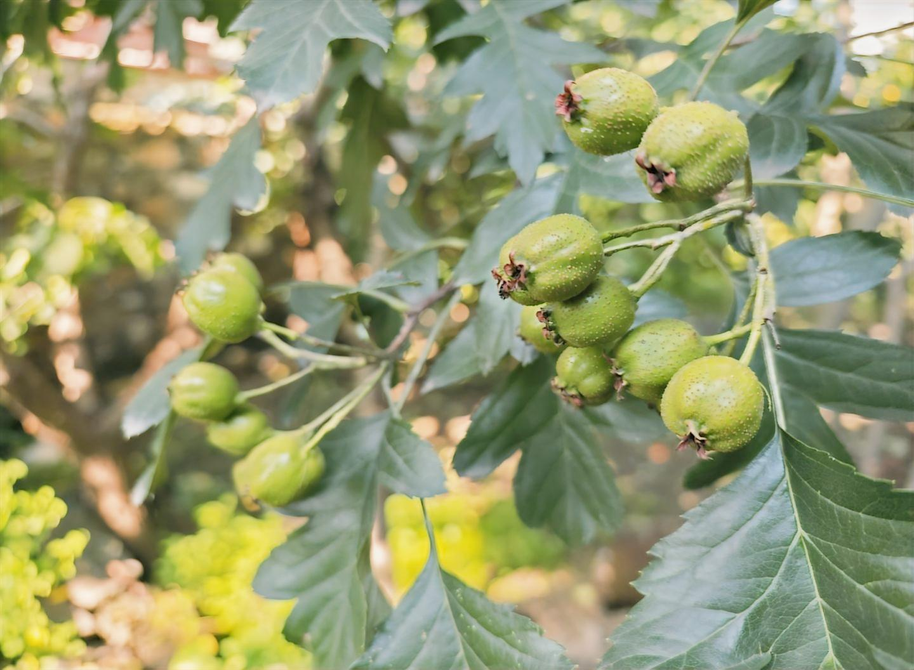
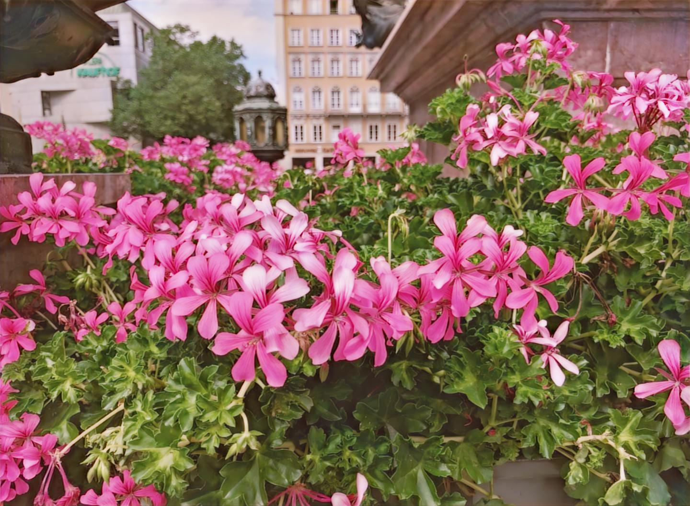

# DeepDigitalFilm

DigitalFilm: Use a neural network to simulate film style.

---

<!-- PROJECT LOGO -->
<br />

<p align="center">
<a href="./readme.md">
</a>

<h3 align="center">"DigitalFilm" Digital Film</h3>
<p align="center">
Use a neural network to simulate film style.
<br />
<a href="https://github.com/shaojintian/Best_README_template"><strong>Explore the documentation of this project »</strong></a>
<br />
<br />
<a href="./app/digitalFilm.py">View the demo</a>
·
<a href="https://github.com/SongZihui-sudo/digitalFilm/issues">Report a bug</a>
·
<a href="https://github.com/SongZihui-sudo/digitalFilm/issues">Propose a new feature</a>
</p>

</p>

This README.md is for developers and users
[简体中文](./chinese.md)

## Table of Contents

- [DigitalFilm Digital Film](#digitalfilm-digital-film)
  - [Table of Contents](#table-of-contents)
    - [Sample](#sample)
    - [Run Demo](#run-demo)
    - [training model](#training-model)
          - [**Installation steps**](#installation-steps)
    - [Overall architecture](#overall-architecture)
    - [Dataset](#dataset)
    - [File directory description](#file-directory-description)
    - [Version Control](#version-control)
    - [Author](#author)
    - [Copyright](#copyright)

### Sample


<center style="font-size:14px;color:#C0C0C0;text-decoration:underline">Figure 1 Sample rollei_infrared_400</center> 


<center style="font-size:14px;color:#C0C0C0;text-decoration:underline">Figure 2 Sample kodak gold 200</center>


<center style="font-size:14px;color:#C0C0C0;text-decoration:underline">Figure 3 Sample fuji color 200</center>

### Run Demo

> The length and width of the input photo need to be divisible by **32**.

```bash
python digitalFilm.py [-v/-h/-g] -i <input> -o <ouput> -m <model>
```
- -v print version information
- -h help information
- -g graphical image selection
- -i input image directory
- -o output image directory
- -m model directory

### training model

training model directly use cyclegan.ipynb.
But you need to download the pre-trained model of resnet18 in advance.
Prepare digital photos and film photos in two folders.
The model are included in the Release.

###### **Installation steps**

```sh
git clone https://github.com/SongZihui-sudo/digitalFilm.git
```

It is best to create an environment in conda now and then install various dependencies.

```sh
pip install -r requirement.txt
```

### Overall architecture

Converting digital photos to film style can be regarded as an image style conversion task. Therefore, the overall architecture adopts the cycleGAN network.
[pytorch-CycleGAN-and-pix2pix](https://github.com/junyanz/pytorch-CycleGAN-and-pix2pix)
In addition, it is difficult to obtain large-scale digital photos and film-style photos, so an unsupervised approach is adopted to use unpaired data for training.

### Dataset

The dataset consists of dual-source image data, the main part of which is collected from high-quality digital photos taken by Xiaomi 13 Ultra mobile phone, and the rest is selected from professional HDR image dataset.
Film samples are collected from the Internet.

### File directory description

- DigitalFilm.ipynb is used to train the model
- app is a demo
- digitalFilm.py
- mynet.py
- mynet2.py

### Version Control

This project uses Git for version management. You can view the currently available version in the repository.

### Author

151122876@qq.com SongZihui-sudo

Zhihu:Dr.who &ensp; qq:1751122876

*You can also view all the developers involved in the project in the list of contributors. *

### Copyright

This project is licensed under GPLv3. For details, please refer to [LICENSE.txt](./LICENSE.txt)