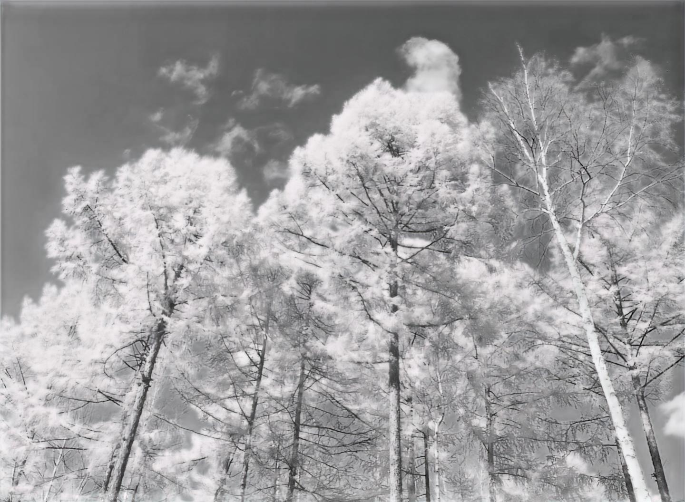

# DigitalFilm 数字胶卷

DigitalFilm：使用神经网络来模拟胶卷风格。

---

<!-- PROJECT LOGO -->
<br />

<p align="center">
  <a href="./readme.md">
  </a>

  <h3 align="center">"DigitalFilm" 数字胶卷</h3>
  <p align="center">
    使用一个神经网络来模拟胶卷风格。
    <br />
    <a href="https://github.com/shaojintian/Best_README_template"><strong>探索本项目的文档 »</strong></a>
    <br />
    <br />
    <a href="./app/digitalFilm.py">查看Demo</a>
    ·
    <a href="https://github.com/SongZihui-sudo/digitalFilm/issues">报告Bug</a>
    ·
    <a href="https://github.com/SongZihui-sudo/digitalFilm/issues">提出新特性</a>
  </p>

</p>


 本篇README.md面向开发者和用户  
 [English](./english.md)

## 目录

- [DigitalFilm 数字胶卷](#digitalfilm-数字胶卷)
  - [目录](#目录)
    - [样片](#样片)
    - [运行 Demo](#运行-demo)
    - [训练模型](#训练模型)
          - [**安装步骤**](#安装步骤)
    - [整体架构](#整体架构)
    - [数据集](#数据集)
    - [文件目录说明](#文件目录说明)
    - [版本控制](#版本控制)
    - [作者](#作者)
    - [版权说明](#版权说明)

### 样片


<center style="font-size:14px;color:#C0C0C0;text-decoration:underline">图1 样片rollei_infrared_400</center> 


<center style="font-size:14px;color:#C0C0C0;text-decoration:underline">图2 样片 kodak gold 200</center> 


<center style="font-size:14px;color:#C0C0C0;text-decoration:underline">图3 样片 fuji color 200</center> 


### 运行 Demo

> 输入照片长和宽需要可以被 **32** 整除。

```bash
python digitalFilm.py [-v/-h/-g] -i <input> -o <ouput> -m <model>
```
- -v 打印版本信息
- -h 帮助信息
- -g 图形化选择图片
- -i 输入图片的目录
- -o 输出图片的目录
- -m 模型目录

### 训练模型

训练模型直接使用 cyclegan.ipynb.  
但是要预先下载 resnet18 的预训练模型。  
在两个文件夹内准备好数码照片与胶片照片。  
在 `app` 文件内附带了柯达金200模型与富士c200模型。

###### **安装步骤**

```sh
git clone https://github.com/SongZihui-sudo/digitalFilm.git
```

最好现在conda里创建好环境，然后安装各种依赖。

```sh
pip install -r requirement.txt
```

### 整体架构

将数码照片转换为胶片风格可以看作是一个图像风格转换任务。所以整体的架构采用了 cycleGAN 网络。
[pytorch-CycleGAN-and-pix2pix](https://github.com/junyanz/pytorch-CycleGAN-and-pix2pix)  
而且获取大规模数码照片与胶片风格照片的数据比较困难，所以采用无监督的方式，使用未配对的数据进行训练。

### 数据集

数据集由双源影像数据构成，主体部分采集自小米13 Ultra 手机拍摄的高质量数码照片，其余选自专业HDR影像数据集。  
胶片样片搜集于网络。

### 文件目录说明

- DigitalFilm.ipynb 用来训练模型
- app   一个 Demo
  - digitalFilm.py 
  - mynet.py
  - mynet2.py
  - kodark_gold_200.pth
  - fuji_color_200.pth

### 版本控制

该项目使用Git进行版本管理。您可以在repository参看当前可用版本。

### 作者

151122876@qq.com SongZihui-sudo

知乎:Dr.who  &ensp; qq:1751122876    

 *您也可以在贡献者名单中参看所有参与该项目的开发者。*

### 版权说明

该项目签署了 GPLv3 授权许可，详情请参阅 [LICENSE.txt](./LICENSE.txt)