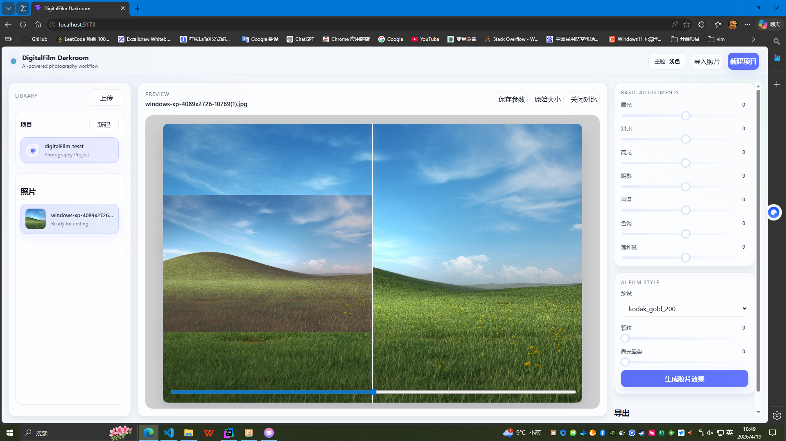

# DigitalFilm

> 使用神经网络模拟胶片风格的数字暗房系统



DigitalFilm 是一个面向胶片风格模拟的项目，包含：

- **模型训练管线**
- **MCP 服务**
- **图像编辑与胶片风格转换应用**
- **主后端 / 静态资源后端 / 图像处理服务**

项目目标是通过神经网络对数字图像进行胶片化渲染，并提供一个可以实际使用的编辑工作流。

---

## 功能概览

- 使用神经网络学习数字图像到胶片风格图像的映射
- 支持基础图像编辑参数预览与保存
- 支持项目 / 图片管理
- 支持图片上传、静态托管、结果图访问
- 支持通过 MCP 接入到其他 AI 应用中使用
- 支持通过独立图像服务执行图像生成与处理

---

## 项目结构

一个典型的结构如下：

```text
DigitalFilm/
├── app/                    # DigitalFilm 应用前端 / 桌面端相关代码
├──────── master_backend/         # 主后端，负责项目、图片、参数等数据管理
├──────── static_backend/         # 静态资源后端，负责托管上传图像和生成结果
├──────── image_server.py         # Python 图像处理服务
├── pipeline.py             # 训练入口
├── mcp_server.py           # MCP 服务入口
├── options/                # 模型与训练配置
├── example/                # 示例图片
└── ...
```

## 环境依赖
使用本项目需要安装：

Python
Go
前端部分如果在 app/ 中使用了vue，还需要：

Node.js
pnpm / npm / yarn

## 模型训练
训练入口为：

```BASH
python pipeline.py
```
你可以通过修改配置文件来调整训练参数，例如：

数据集路径  
batch size  
学习率  
LUT 维度  
是否启用 3D / 4D LUT  
basis 数量  
residual / blend 等选项

## MCP 服务
项目提供了 MCP 服务，可以供其他 AI 应用接入使用。

启动方式：

```BASH
python mcp_server.py
```
启动后，你可以将该 MCP 服务接入支持 MCP 的 AI 应用或代理系统中，用于调用 DigitalFilm 的能力。

## 应用启动方式
app/ 内提供了 DigitalFilm 应用，可以支持：

简单图像编辑  
图片上传与项目管理  
胶片风格转换  
图片参数保存与恢复  
使用前准备  
使用 DigitalFilm App 需要先启动以下服务： 

Python 图像编辑服务器  
Go 主后端  
Go   
1. 启动图像处理服务
图像处理服务负责执行图像生成 / 图像编辑 / 模型推理相关能力。

```BASH
python image_server.py
```

2. 启动主后端
主后端负责：

项目数据管理  
图片信息管理  
编辑参数存储  
预设配置管理  
与前端的数据交互  
进入主后端目录后编译并运行：  


``` BASH
go run .
```
或者先编译：

```BASH
go build -o master_backend
./master_backend
```

3. 启动静态资源后端
静态资源后端负责：  

托管上传的原始图片  
托管生成后的结果图片  
提供 HTTP 访问地址供前端和其他后端使用  
进入静态后端目录后编译并运行：  

```BASH
go run .
```

或者：

```BASH
go build -o static_backend
./static_backend
```
4. 启动 App
如果 app/ 是前端项目：

```BASH
cd app
npm run dev
```
或：

```BASH
pnpm dev
```
启动后即可在浏览器中使用 DigitalFilm 应用。

推荐启动顺序  
建议按以下顺序启动：

```
python image_server.py  
master_backend  
static_backend  
app
```

## DigitalFilm App 功能说明  
应用当前支持：

- 创建项目  
- 上传图片  
- 查看图片列表  
- 基础编辑参数调整  
  - 曝光  
  - 对比  
  - 高光  
- 胶片风格参数调整  
  - 预设  
  - 颗粒 
  - 高光晕染

## 模型说明  

digitalFilmv2 是一个轻量级的数字到胶片风格生成模型，核心思路 包括：

Basis 3D LUT mixture
可选 Basis 4D LUT mixture
全局特征网络预测 LUT mixing weights
可选 residual blending
LUT regularization
Total Variation
Monotonicity regularization

模型支持：
- use_3d
- use_4d
- num_basis_3d
- num_basis_4d
- lut3d_dim
- lut4d_dim
- num_context_bins
- learn_blend

其整体目标是以较轻量的方式结合可解释的 LUT 表达能力与神经网络预测能力，实现具有胶片感的数字图像渲染。

模型主要由以下模块构成：

1. GlobalFeatureNet
一个轻量 CNN，用于从输入图像中提取全局特征，并预测：

- 3D LUT basis 权重
- 4D LUT basis 权重
- 分支融合权重

2. BasisLUT3D
学习多个可训练的 3D LUT basis，并通过预测权重进行融合：

- 输出融合后的 3D LUT
- 加上 identity LUT 作为初始基准
- 保持输出在 [0, 1]

3. BasisLUT4D
学习多个可训练的 4D LUT basis，并结合上下文维度进行更复杂的颜色映射。

4. TV / Monotonicity Regularization
为了保证 LUT 的平滑性与合理性，训练中加入：

- TV 正则
- 单调性正则

5. Residual Blending
在最终输出中加入一定比例的输入图像，有助于提升稳定性与自然感：

```TEXT
out = 0.7 * lut_output + 0.3 * input
```

## 开发说明
项目目前由多个服务组成，建议在开发时分别调试：

Python 模型 / 图像服务
Go 主后端
Go 静态资源后端
前端 App
